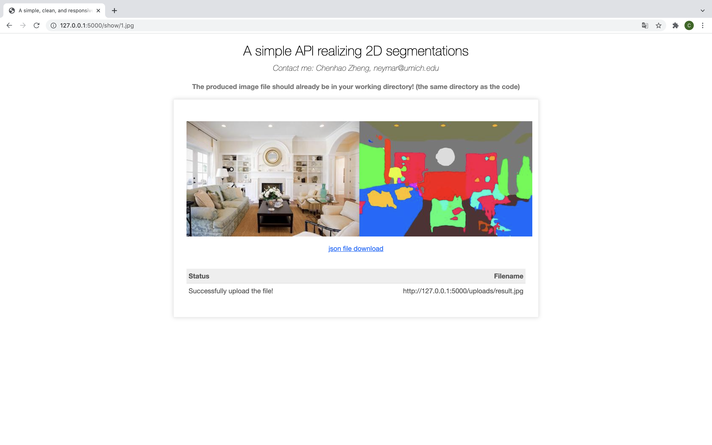
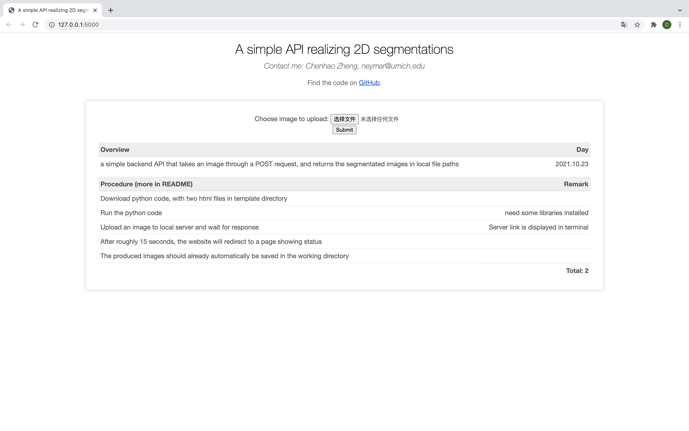

# README

This is a a simple backend API that takes an image through a POST request, and returns the segmentated images in local file paths. The algorithm is based on the benchmark semantic segmentation network from the the [ADE20K MIT Scene Parsing Benchchmark](http://sceneparsing.csail.mit.edu/).

## Supported Function

The image augmentation tasks is about manipulating existing data to augment it and generate additional variations based on it. By “segmentation”, it’s about generating masks on an image that represent different parts of an image, e.g., different objects, surfaces, etc. The example of the supported functions of our model as follows:

Suppose the the user's input image (through post request) is: 


This program will output the images as follows: (show on website & download as two files to local directory) 


Also, there is a link in website where you can download the segmented masks in JSON:



## How to use it

​	There are two ways to run the code of this project: in **local machine** or in **google colab**. Although running in google colab might be much simpler, because of google colab does not support local server website, we have to use `run_with_ngrok` function imported from `flask_ngrok` library, in which the produced image and file can only be downloaded to local directory. On the other hand, while running in local machine might take more work, it supports full function including both showing result in website and downloading to local directory.

#### Run in Colab

1. Download the **DemoSegmenter.ipynb** file from my Github repository: https://github.com/zhengchenhao-solo/A-simple-API-realizing-2D-segmentations
2. Construct a new folder called `template` in the working directory and put two html files: `index.html` and `login.html` in it.
3. Just simply  follow the instruction in .ipynb file to run the code. 

#### Run in local machine

1. Download the **DemoSegmenter.py** file from my Github repository: https://github.com/zhengchenhao-solo/A-simple-API-realizing-2D-segmentations

2. After putting  the codes into your python project, run the following bash command:

   ```bash
   %%bash
   !(stat -t /usr/local/lib/*/dist-packages/google/colab > /dev/null 2>&1) && exit 
   pip install yacs 2>&1 >> install.log
   git init 2>&1 >> install.log
   git remote add origin https://github.com/CSAILVision/semantic-segmentation-pytorch.git 2>> install.log
   git pull origin master 2>&1 >> install.log
   DOWNLOAD_ONLY=1 ./demo_test.sh 2>> install.log
   ```

3. Construct a new folder called `template` in the working directory and put two html files: `index.html` and `login.html` in it.

4. Install all the necessary libraries that will be needed when running the code, including **flask, numpy, PIL.Image, pytorch**

5. Run the code and click on the local server link shown in the output,, you will be directed to the home page of produced website like this: 

   

6. Choose the image that you want to process, and click submit.

7. **Wait for 10-20 seconds for the server to process**. When the process is finished, you will be **redirected to another web page** showing the result. **At the same time,** you would be able to **see the produced image file and json file ** **in your working directory.**

   

